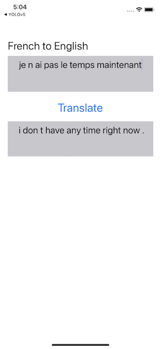
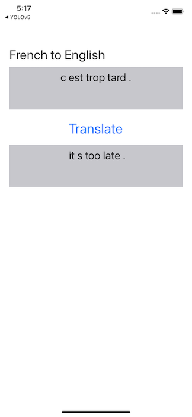

# Neural Machine Translation on iOS

## Introduction

The PyTorch tutorial [NLP FROM SCRATCH: TRANSLATION WITH A SEQUENCE TO SEQUENCE NETWORK AND ATTENTION](https://pytorch.org/tutorials/intermediate/seq2seq_translation_tutorial.html) is an easy-to-follow tutorial that has step-by-step instructions on how to train sequence to sequence encoder and decode networks with an attention mechanism for neural machine translation. Although the quality of the translation between English and French using the model in the tutorial may not be as good as a leading-edge transformer based model, it presents a great example of how to deploy an interesting model trained from scratch in an iOS app.

This iOS demo app shows:

* The Python code that saves the encoder and attention-enhanced decoder models, trained based on the code in the PyTorch NMT tutorial;
* The Python code that loads the saved encoder and decoder models, optimizes them and saves again for mobile apps to use;
* The iOS app that uses the encoder and decoder models to do French-English translation.

## Prerequisites

* PyTorch 1.9 or later (Optional)
* Python 3.8 (Optional)
* iOS Cocoapods library LibTorch-Lite 1.9.0
* Xcode 12 or later

## Quick Start

To Test Run the Object Detection iOS App, follow the steps below:

### 1. Prepare the Model

If you don't have the PyTorch environment set up to run the script, you can download the PyTorch trained and optimized NMT encoder and decoder models compressed in a zip [here](https://pytorch-mobile-demo-apps.s3.us-east-2.amazonaws.com/Seq2SeqNMT_models.zip), unzip it, copy to the iOS app project folder, and continue to Step 2.

If you have a good GPU and want to train your model from scratch, uncomment the line `trainIters(encoder, decoder, 450100, print_every=5000)` in `seq2seq_nmt.py` before running `python seq2seq2_nmt.py` to go through the whole process of training, saving, loading, optimizing and saving the final mobile-ready models. Otherwise, run the script to create `optimized_encoder_150k.ptl` and `optimized_decoder_150k.ptl`, and copy them to the iOS app. Note that dynamic quantization is applied to the decoder in `seq2seq2_nmt.py` for its `nn.Linear` parameters to reduce the decoder model size from 29MB to 18MB.

### 2. Use LibTorch-Lite

Run the commands below:

```
cd Seq2SeqNMT
pod install
open Seq2SeqNMT.xcworkspace/
```

### 3. Build and run with Xcode

Select an iOS simulator or device on Xcode to run the app. See this [video](https://drive.google.com/file/d/17Edk-yAyfzijHPR_2ZDAIX7VY-TkQnLf/view) for a screencast of the app running.Some example results are as follows:




