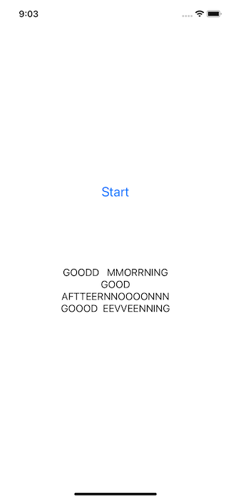
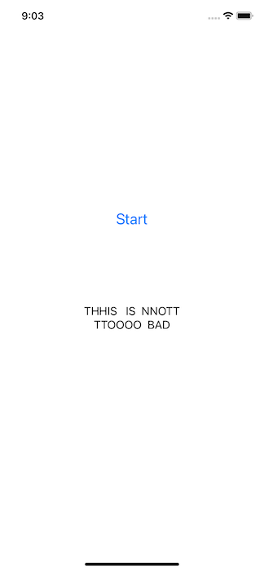
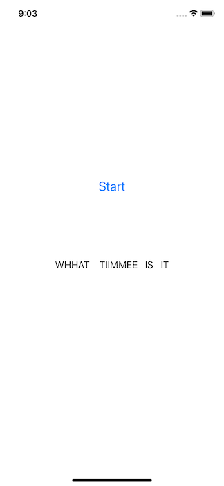

# Speech Recognition on iOS with Wav2Vec2

## Introduction

Facebook AI's [wav2vec 2.0](https://github.com/pytorch/fairseq/tree/master/examples/wav2vec) is one of the leading models in speech recognition. It is also available in the [Hugging Face Transformers](https://github.com/huggingface/transformers) library, which is also used in another PyTorch iOS demo app for [Question Answering](https://github.com/pytorch/ios-demo-app/tree/master/QuestionAnswering).

In this demo app, we'll show how to quantize, trace, and optimize the wav2vec2 model, powered by the newly released torchaudio 0.9.0, and how to use the converted model on an iOS demo app to perform speech recognition.

## Prerequisites

* PyTorch 1.9 and torchaudio 0.9 (Optional)
* Python 3.8 or above (Optional)
* iOS Cocoapods LibTorch-Lite 1.9.0
* Xcode 12.4 or later

## Quick Start

### 1. Get the Repo

Simply run the commands below:

```
git clone https://github.com/pytorch/ios-demo-app
cd ios-demo-app/SpeechRecognition
```

If you don't have PyTorch 1.9 and torchaudio 0.9 installed or want to have a quick try of the demo app, you can download the quantized scripted wav2vec2 model file [here](https://pytorch-mobile-demo-apps.s3.us-east-2.amazonaws.com/wav2vec2.ptl), then drag and drop to the project, and continue to Step 3.

### 2. Prepare the Model

To install PyTorch 1.9, torchaudio 0.9 and the Hugging Face transformers, you can do something like this:

```
conda create -n wav2vec2 python=3.8.5
conda activate wav2vec2
pip install torch torchaudio
pip install transformers
```

Now with PyTorch 1.9 and torchaudio 0.9 installed, run the following commands on a Terminal:

```
python create_wav2vec2.py
```

This will create the model file `wav2vec2.ptl` and save to the `SpeechRecognition` folder.

### 2. Use LibTorch

Run the commands below:

```
pod install
open SpeechRecognition.xcworkspace/
```

### 3. Build and run with Xcode

After the app runs, tap the Start button and start saying something; after 12 seconds (you can change `private let AUDIO_LEN_IN_SECOND = 12` in `ViewController.swift` for a longer or shorter recording length), the model will infer to recognize your speech. Some example results are as follows:




