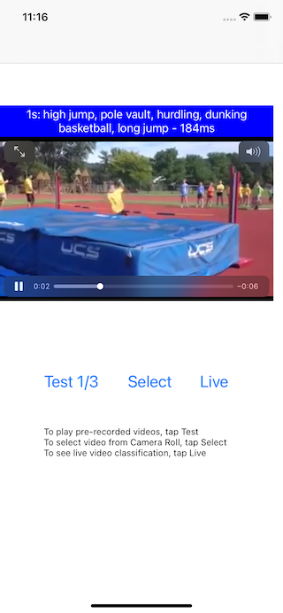
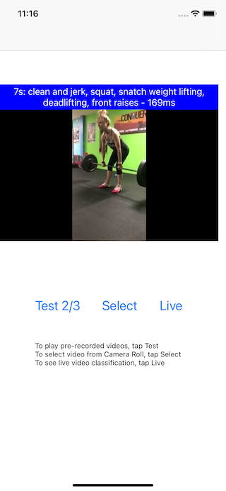
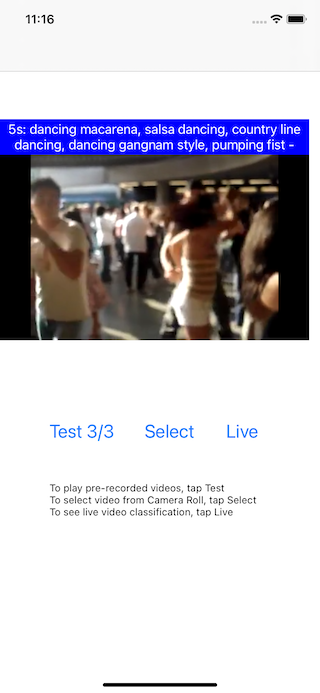

# PyTorch Video Classification on iOS

## Introduction

The just released open-sourced PyTorch Video adds video classification, among other things, to the popular torchvision. This PyTorch Video Classification on iOS demo app shows how to use a pre-trained PyTorch Video classification model on Android to see real-time video classification results per second while the video plays.

## Prerequisites

* PyTorch 1.8.0/1.8.1, torchvision 0.9.1, PyTorchVideo (Optional)
* Python 3.8 or above (Optional)
* Python 3.8 (Optional)
* iOS PyTorch pod library 1.8
* Xcode 12 or later


## Quick Start

### 1. Prepare the Model (Optional)

If you don't have the PyTorch environment set up to run the script, you can download the model file `video_classification.pt` [here](https://drive.google.com/file/d/1qweDu7QZv7xJA7Sx_UIxjvcS7y1rQ2kE/view) to the `ios-demo-app/TorchVideo/TorchVideo` folder, then skip the rest of this step and go to step 2 directly.

Be aware that the downloadable model file was created with PyTorch 1.8.0, matching the iOS LibTorch library 1.8.0 specified in the `Podfile`. If you use a different version of PyTorch to create your model by following the instructions below, make sure you specify the same iOS LibTorch version in the `Podfile` to avoid possible errors caused by the version mismatch. Furthermore, if you want to use the latest prototype features in the PyTorch master branch to create the model, follow the steps at [Building PyTorch iOS Libraries from Source](https://pytorch.org/mobile/ios/#build-pytorch-ios-libraries-from-source) on how to use the model in iOS.

To create the model yourself, simply run the following commands:
```
conda activate pt181
pip install torch torchvision

# pip list|grep torch
# torch             1.8.1
# torchvision       0.9.1

pip install pytorchvideo

cd ios-demo-app/TorchVideo
python build_model.py

```
The model file `video_classification.pt` will be created and saved in the project folder.

### 2. Use LibTorch

Run the commands below:

```
pod install
open TorchVideo.xcworkspace/
```

### 3. Run the app

Select an iOS simulator or device on Xcode to run the app. You can go through the included example test images to see the detection results. You can also select a picture from your iOS device's Photos library, take a picture with the device camera, or even use live camera to do object detection - see this [video](https://drive.google.com/file/d/1ijb4UIuF2VQiab4xfAsBwrQXCInvb9wd/view) for a screencast of the app running.

Some screenshots of the video classification results are as follows:




